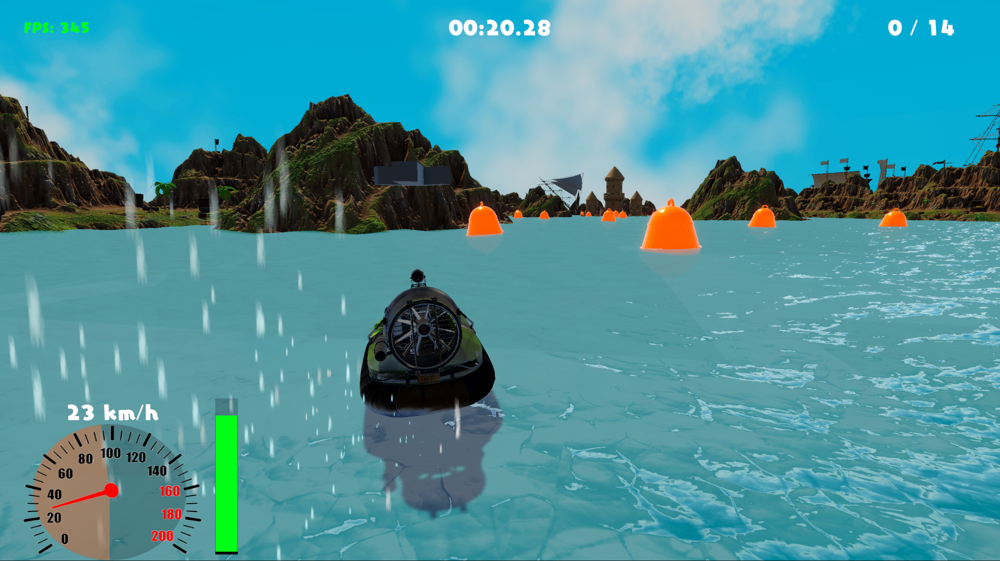

# 🚤 HydroHover Simulator

**HydroHover Simulator** — это физический симулятор управления судном на воздушной подушке (Hovercraft), разработанный на Unity.

Проект демонстрирует реализацию кастомной физики (аэро- и гидродинамики), продвинутую архитектуру на базе DI (Zenject) и работу с асинхронной загрузкой контента (Addressables).

---

## 🎮 Демонстрация

## ✨ Ключевые особенности

### 🌊 Физика и Математика
*   **Кастомная модель плавучести:** Реализация воздушной подушки через закон Гука и демпфирование (`F = -kx - cv`), учитывающая профиль волны.
*   **Волны Герстнера:** Синхронизация физического просчета волн (C#) и визуализации (Shader Graph) для корректного взаимодействия судна с водой.
*   **Симуляция ДВС:** Двигатель с кривой крутящего момента (`Torque Curve`), инерцией маховика и отсечкой оборотов.
*   **Аэродинамика:** Расчет лобового и бокового сопротивления (Drag), влияние ветра и управляемый занос (Drift).

### 🏗 Архитектура и Технологии
*   **Dependency Injection:** Полное внедрение зависимостей через **Zenject**. Разделение на `ProjectContext` (Global) и `SceneContext` (Gameplay).
*   **State Machine:** Управление потоком игры (Bootstrap -> LoadLevel -> GameLoop) через конечный автомат.
*   **Addressables & Async:** Асинхронная загрузка сцен, UI-окон и префабов. Использование **UniTask** для чистого асинхронного кода.
*   **UI Framework:** Оконная система с фабрикой, поддерживающая вложенность и асинхронное создание окон.
*   **Input System:** Поддержка ребиндинга клавиш с сохранением в JSON.

---

## 🕹 Управление

| Действие | Клавиша (PC) | Описание |
| :--- | :--- | :--- |
| **Газ / Тормоз** | `W` / `S` | Управление маршевым винтом (Thrust) |
| **Поворот** | `A` / `D` | Аэродинамические рули |
| **Мощность подушки** | `↑` / `↓` | Регулировка оборотов нагнетателя (Lift) |
| **Ручной тормоз** | `Space` | Экстренное гашение подъемной силы |
| **Рестарт** | `R` | Быстрый перезапуск уровня |
| **Пауза** | `Esc` | Меню паузы |

---

## 🛠 Технический стек
*   **Engine:** Unity 6
*   **Render Pipeline:** URP (Universal Render Pipeline)
*   **Plugins:**
    *   Zenject (DI)
    *   UniTask (Async/Await)
    *   Addressables (Asset Management)
    *   Cinemachine (Dynamic Camera)
    *   Newtonsoft.Json (Serialization)

---

## 📂 Структура проекта
Проект следует принципам **Clean Architecture** и разделен на слои:

*   `Core`: Ядро игры (Bootstrap, State Machine).
*   `Infrastructure`: Сервисы, Фабрики, Инсталлеры, Провайдеры ассетов.
*   `Physics`: Физические контроллеры (Hover, Water, Wind).
*   `Features`: Игровые механики (Audio, Checkpoints, VFX).
*   `UI`: Логика окон и HUD.
*   `Data`: Конфиги и структуры данных.

---

## 🚀 Установка и Запуск
1.  Клонируйте репозиторий.
2.  Откройте проект в Unity (версия 2022.3+).
3.  Откройте сцену **Bootstrap** (`Assets/Scenes/Bootstrap.unity`).
4.  Убедитесь, что группы Addressables собраны (Window -> Asset Management -> Addressables -> Groups -> Build -> New Build -> Default Build Script).
5.  Нажмите **Play**.

---
